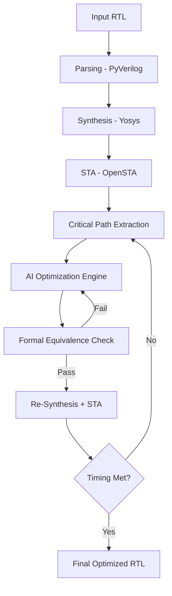

```mermaid
flowchart TD
    A[Input RTL] --> B[Parsing - PyVerilog]
    B --> C[Synthesis - Yosys]
    C --> D[STA - OpenSTA]
    D --> E[Critical Path Extraction]
    E --> F[AI Optimization Engine]
    F --> G[Formal Equivalence Check]
    G -->|Pass| H[Re-Synthesis + STA]
    G -->|Fail| F
    H --> I{Timing Met?}
    I -->|No| E
    I -->|Yes| J[Final Optimized RTL]
```